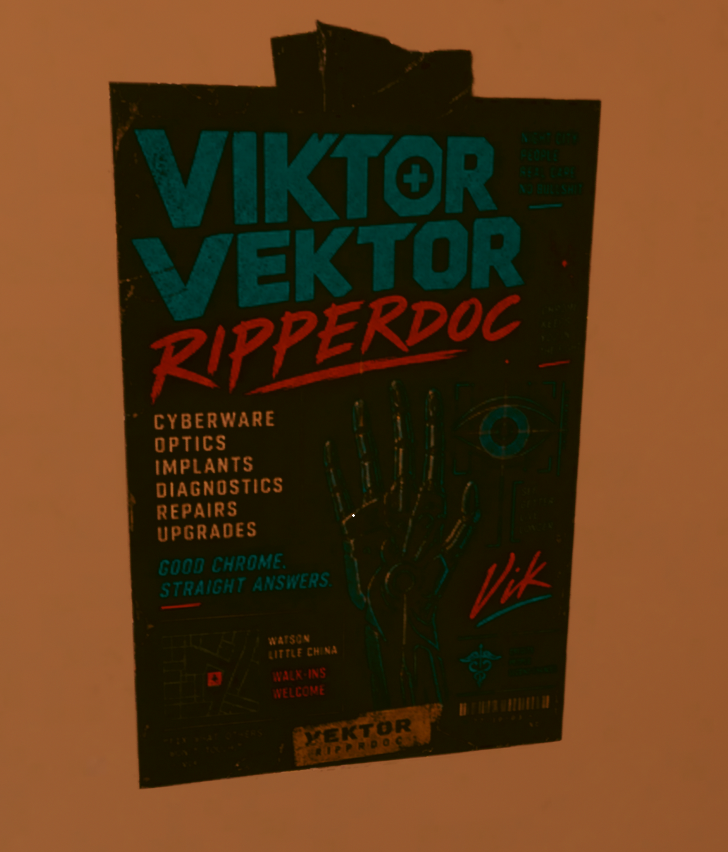

<div align="center">


# Viktor Vektor Ripperdoc Poster - H10 Bathroom

**Give V's H10 bathroom a little more Night City character.**


</div>

---

This mod replaces the vanilla shower/toilet directional arrows in V's H10 apartment bathroom with a custom Viktor Vektor Ripperdoc advertisement.

The poster was designed to feel like an actual neighborhood advertisement you might find taped to a wall in Watson, promoting Vik's clinic, cyberware services, optics, implants, diagnostics, repairs, and upgrades.

The original bathroom decal placement is retained, including the taped-to-the-wall appearance, so the replacement integrates naturally into the apartment rather than looking like a newly placed object.

<p align="center">
  
</p>

---

## Features

- Custom Viktor Vektor Ripperdoc advertisement
- Replaces the H10 bathroom shower/toilet directional arrows
- Designed to blend naturally with Cyberpunk 2077's visual style
- Uses the existing in-game decal placement
- Updated and tested with Cyberpunk 2077 2.31
- No scripts
- No CET required
- No additional dependencies

---

## Installation

Install with Vortex, or manually place the included `.archive` file into:

```text
Cyberpunk 2077\archive\pc\mod
```

---

## Uninstallation

Remove the mod through Vortex, or delete its `.archive` file from:

```text
Cyberpunk 2077\archive\pc\mod
```

The original shower/toilet arrows will return.

---

## Compatibility

This mod replaces the H10 bathroom's

```text
shower_toilet_sign
```

material/texture.

Any other mod that replaces the same bathroom sign will conflict. Use only one replacement for this decal at a time.

---

## Credits

Created by Big2What.

Built and tested using WolvenKit for Cyberpunk 2077 2.31.
